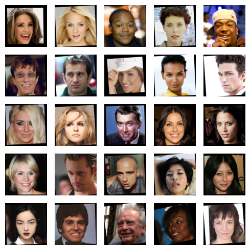
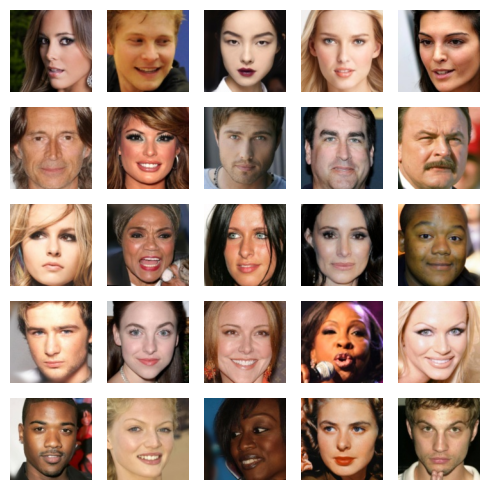

## Выравнивание лиц с помощью OpenCV-2

Делаем выравнивание на примере [датасета](https://huggingface.co/datasets/bitmind/celeb-a-hq_training_faces) `bitmind/celeb-a-hq_training_faces`

### Пример выравнивания

Исходные изображения:

Выровненные изображения:

